# **Práctica 1 de Interfaces Inteligentes**
## **Autor**: Francisco Jesus Mendes Gomez

## **Índice:**  

1. [**Resultados de la ejecución**](#id1)
2. [**Resumen de la práctica**](#id2)  

<div name="id1" />

## 1. Resultados de la ejecución
En esta práctica he decidido utilizar tres cámaras estáticas dispuestas desde ángulos diferentes
+ Cámara principal

  
  
+ Cámara secundaria 1  
  


+ Cámara secundaria 2  
  


  NOTA: En las tres vistas podemos observar la ejecución de la escena y la ejecución de los scripts en la consola.  

<div name="id2" />

## 2. Resumen de la práctica

1. El primer paso como es lógico fue crear una cuenta de Unity, descargar e instalar Unity y también descargar los Assets: `Standard Assets`, entre otros, desde la Assets Store de Unity.  


2. El segundo paso fue añadir los siguientes elementos:

+ Objetos 3D básicos

En este casos he utilizado un cubo y dos esferas las cuales se observan continuación:  

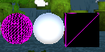  


+ Objeto complejo de Standard Assets.

Para este caso he utilizado dentro del Standard Assets el jet y el rollerball que observamos a continuación.

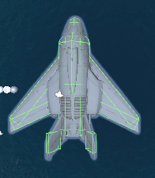  


+ Objeto libre de la Asset Store que no sea de los Standard Assets.

Aqui he incluido el dragón de un Asset llamado `Dragon Bot`.
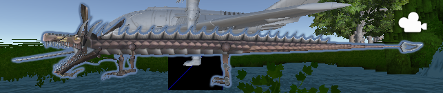

+ Terreno.

He creado un terreno utilizando las herramienta que trae Unity  

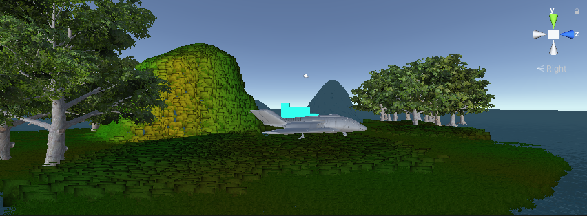

+ La escena debe tener 2 fuentes de luz.

La escena cuenta con 3 iluminaciones: 1 direccional y otras 2 de punto.  

+ Utilizar prefabs de standard assets para un FPS o Third Person
  
Aqui he decidido usar a Ethan de la standard assets.  

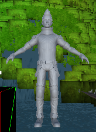  

1. Después de crear los objetos, a cada uno se les ha creado y colocado una etiqueta que los identifica con una palabra única. Ejemplo:

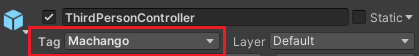  


4. Por último se ha creado un script que escriba en la consola los objetos que se han utilizado, un identificador numérico que le asignes a cada uno de los objetos y el valor de un contador que se actualiza en cada iteración para cada objeto. 

+ Para esto a cada objeto le he añadido un script como este:  

```c#
using System.Collections;
using System.Collections.Generic;
using UnityEngine;

public class NombreDelObjeto : MonoBehaviour
{
    public GameObject objeto; 
    int contador = 0;
    // Start is called before the first frame update
    void Start()
    {
        objeto = GameObject.FindWithTag("Tag del Objeto");
    }

    // Update is called once per frame
    void Update()
    {
      Debug.Log($"Nombre del Objeto: {objeto.name}; Tag: {objeto.tag}; Contador del objeto: {contador++}"); 
    }
}

```
De la siguiente manera:

1. Buscamos en el inspector el botón  `Add Component`

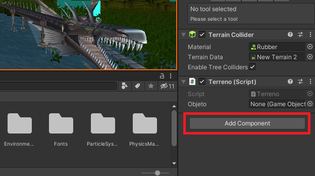

2. Seleccionamos `New Script`

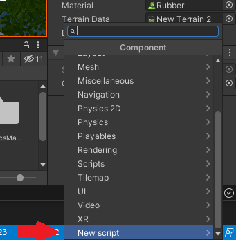

3. Escribimos el nombre del script que queremos crear y le damos al botón `Create and Add`.

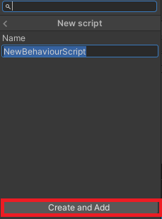
  
Luego, una vez creado podemos abrir el script y editarlo, por ejemplo, usando Visual Studio Code.

Con esto hemos obtenido el siguiente resultado en consola:

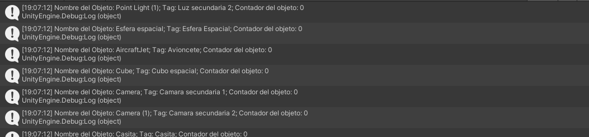  

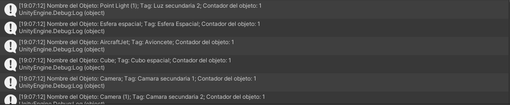

Podemos observar el como cada objeto actualiza su contador correctamente mostrando también su nombre y su etiqueta.